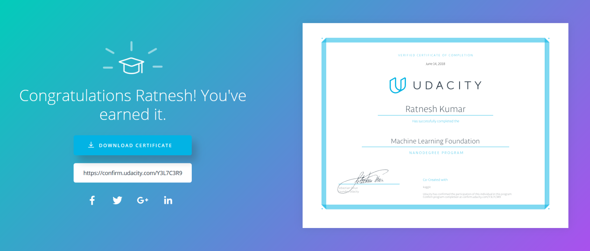

# Udacity - Machine Learning Foundation Nanodegree

# Projects in Machine Learning Foundation Nanodegree

1. [Explore US Bikeshare Data](https://github.com/soni-ratnesh/Machine-Learning-Foundation-Nanodegree/tree/master/Explore-Us-Bikeshare-Data)

2. Test a Perceptual Phenomenon

3. Investigate a Dataset

4. Predicting Boston Housing Prices
